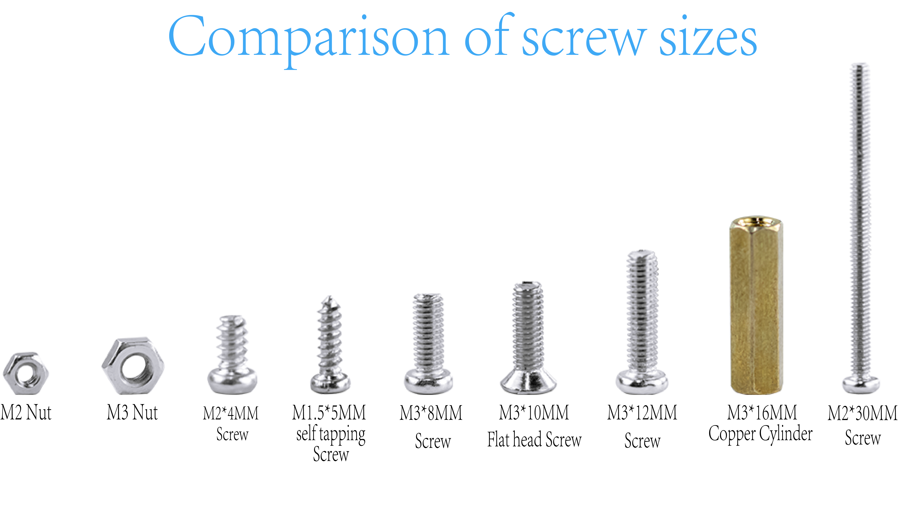
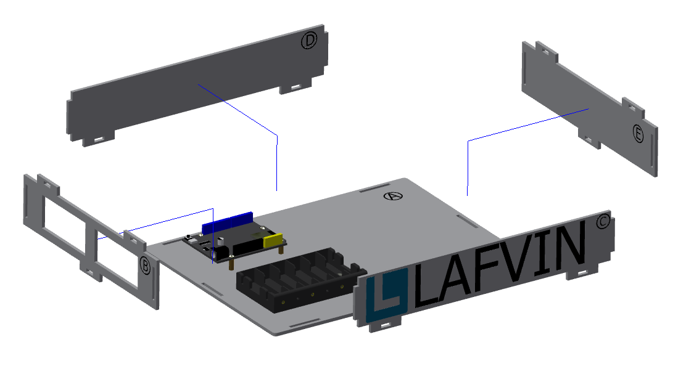

Smart Home Assembly Tutorial
============================

.. figure:: _static/1/1.SmartHome.png
   :alt: The effect picture of the cabin installation
   :align: center

   （Design sketch of smart house installation）

Introduction
------------
  This tutorial is for installing the "LA-Smart-Home" smart home. To ensure an efficient and error-free installation, please carefully read all steps and precautions before installation.

Installation video tutorial
----------------------------
（此处会插入一段安装的视频教程）

Screw size comparison
---------------------
 - This product requires several different screw types during installation. Before installation, please verify each screw type and follow the instructions in this tutorial to use the specified screw type.
 - Mixing or substituting screw types is strictly prohibited. This may cause installation failure or damage to the product due to screw mismatches. If you are unable to identify the screw type, please discontinue operation and refer to the accessories list or contact customer service for confirmation.

*Now, please follow the steps in this tutorial and let’s start installing the "LA-Smart-Home" smart home cabin.*

Installation of base part
--------------------------

Step 1: Install the ESP32 development board
~~~~~~~~~~~~~~~~~~~~~~~~~~~~~~~~~~~~~~~~~~~

Parts list: Basswood board with "A"、 ESP32 development board、 M3*8mm screw (8 PCS)、 M3*16mm copper pillar (4 PCS).

The installation is shown in the following figure:

.. image:: _static/1/3.ESP32.png
   :alt: ESP32 development board installation
   :align: center

.. raw:: html

   

.. admonition:: Precautions

 - First, insert the screws through the underside of the basswood board numbered "A," then place the copper standoffs and tighten them. Next, place the ESP32 development board and tighten the screws to secure it.
 - The serial numbers on the basswood boards are used only to distinguish one board from another. In the tutorial examples, the serial numbers face outward for ease of illustration, but they should face inward during installation. This principle should also be followed for subsequent basswood installations.

Step 2: Install the battery box
~~~~~~~~~~~~~~~~~~~~~~~~~~~~~~~

Parts list: battery box、 M3*10mm flat head screw (2 PCS)、 M3 nut (2 PCS).

The installation is shown in the following figure:

.. image:: _static/1/4.Battery.png
   :alt: Battery box installation
   :align: center
 

.. admonition:: Precautions

 - When securing the battery compartment, use flat-head screws. If you use round-head screws, the screws will protrude and press against the battery, preventing it from being installed properly.

Step 3: Install the base
~~~~~~~~~~~~~~~~~~~~~~~~

Parts list: Basswood boards with "B, C, D, E, F"、 blue latch (6 PCS).

The installation is shown in the following figure:

.. image:: _static/1/6.Base2.png
   :alt: Base installation2
   :align: center
 

.. admonition:: Precautions

 - The order in which basswood boards with "B, C, D, E" can be installed is not restricted, but basswood board "F" must be installed after them.
 - In this step, only the six bottom latches need to be installed. The latches connected to the basswood board "F" do not need to be installed yet.

The effect of the base installation is shown in the figure:

.. image:: _static/1/7.Base_completed.png
   :alt: 底座安装
   :align: center