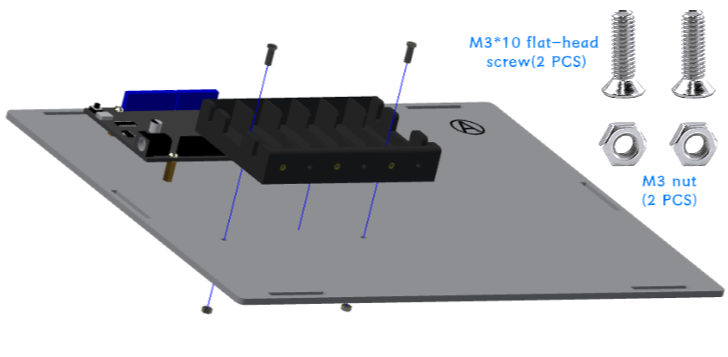
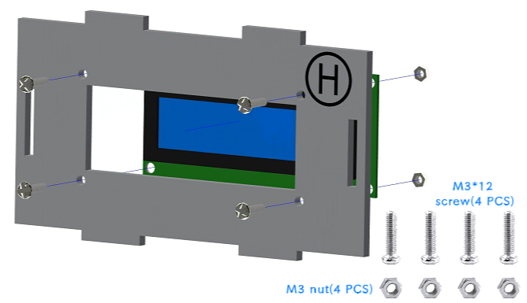
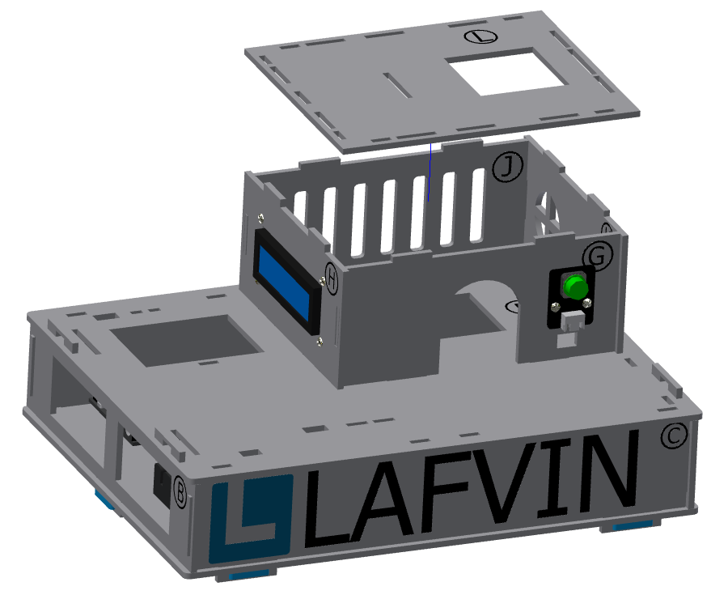
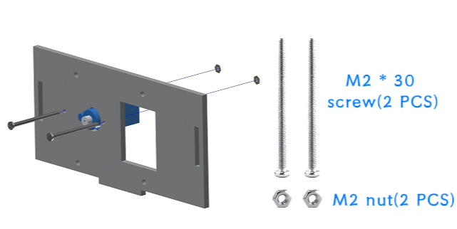
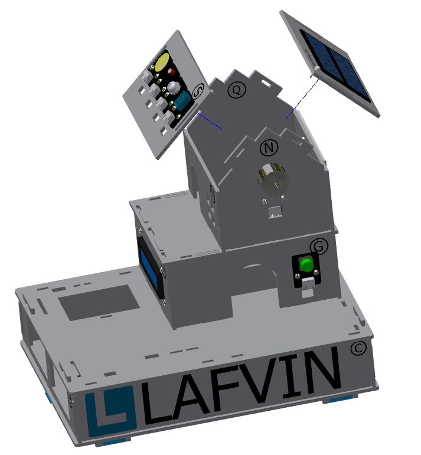

Smart Home Assembly Tutorial
============================

.. figure:: _static/1/1.SmartHome.png
   :alt: The effect picture of the cabin installation
   :align: center

   （Design sketch of smart house installation）

Introduction
------------
  This tutorial is for installing the "LA-Smart-Home" smart home. To ensure an efficient and error-free installation, please carefully read all steps and precautions before installation.

Installation video tutorial
~~~~~~~~~~~~~~~~~~~~~~~~~~~
（此处会插入一段安装的视频教程）

Screw size comparison
~~~~~~~~~~~~~~~~~~~~~
 - This product requires several different screw types during installation. Before installation, please verify each screw type and follow the instructions in this tutorial to use the specified screw type.
 - Mixing or substituting screw types is strictly prohibited. This may cause installation failure or damage to the product due to screw mismatches. If you are unable to identify the screw type, please discontinue operation and refer to the accessories list or contact customer service for confirmation.

.. figure:: _static/1/2.Screw.png
   :alt: Screw comparison
   :align: center

*Now, please follow the steps in this tutorial and let’s start installing the "LA-Smart-Home" smart home cabin.*

----

Installation of base part
--------------------------

Step 1: Install the ESP32 development board
~~~~~~~~~~~~~~~~~~~~~~~~~~~~~~~~~~~~~~~~~~~

Parts list: Basswood board with "A"、 ESP32 development board、 M3*8mm screw (8 PCS)、 M3*16mm copper pillar (4 PCS).

The installation is shown in the following figure:

.. image:: _static/1/3.ESP32.png
   :alt: ESP32 development board installation
   :align: center

.. raw:: html

   

.. admonition:: Precautions

 - First, insert the screws through the underside of the basswood board numbered "A," then place the copper standoffs and tighten them. Next, place the ESP32 development board and tighten the screws to secure it.
 - The serial numbers on the basswood boards are used only to distinguish one board from another. In the tutorial examples, the serial numbers face outward for ease of illustration, but they should face inward during installation. This principle should also be followed for subsequent basswood installations.

Step 2: Install the battery box
~~~~~~~~~~~~~~~~~~~~~~~~~~~~~~~

Parts list: battery box、 M3*10mm flat head screw (2 PCS)、 M3 nut (2 PCS).

The installation is shown in the following figure:

 

.. admonition:: Precautions

 - When securing the battery compartment, use flat-head screws. If you use round-head screws, the screws will protrude and press against the battery, preventing it from being installed properly.

Step 3: Install the base
~~~~~~~~~~~~~~~~~~~~~~~~

Parts list: Basswood boards with "B, C, D, E, F"、 blue latch (6 PCS).

The installation is shown in the following figure:

.. image:: _static/1/5.Base1.png
   :alt: Base installation1
   :align: center

.. image:: _static/1/6.Base2.png
   :alt: Base installation2
   :align: center
 

.. admonition:: Precautions

 - The order in which basswood boards with "B, C, D, E" can be installed is not restricted, but basswood board "F" must be installed after them.
 - In this step, only the six bottom latches need to be installed. The latches connected to the basswood board "F" do not need to be installed yet.

The effect of the base installation is shown in the figure:

.. image:: _static/1/7.Base_completed.png
   :alt: 底座安装
   :align: center

----

Installation of the first floor of the cabin
--------------------------------------------

Step 1: Install the button module
~~~~~~~~~~~~~~~~~~~~~~~~~~~~~~~

Parts list: Basswood board with "G"、 button module、 M3*12mm screw (2 PCS)、 M3 nut (2 PCS).

The installation is shown in the following figure:

.. image:: _static/1/8.button.png
   :alt: button
   :align: center

Step 2: Installation LCD screen
~~~~~~~~~~~~~~~~~~~~~~~~~~~~~~~

Parts list: Basswood board with "H"、 LCD screen、 M3*12mm screw (4 PCS)、 M3 nut (4 PCS).

The installation is shown in the following figure:

.. image:: _static/1/10.lcd2.png
   :alt: LCD2
   :align: center
   :width: 600px

.. admonition:: Precautions

 - When installing the screen, please make sure that the black panel with the socket is facing upwards to prevent the screen from being displayed upside down due to incorrect installation direction.

Step 3: Installation of the first floor of the cabin
~~~~~~~~~~~~~~~~~~~~~~~~~~~~~~~~~~~~~~~~~~~~~~~~~~~~~

Parts list: Basswood boards with "J, K, L", and "G, H" with screen and buttons installed.

The installation is shown in the following figure:

 

.. image:: _static/1/13.floor1_3.png
   :alt: floor1_3
   :align: center

.. admonition:: Precautions

 - Basswood boards with "G, H, J, K" have different protrusion lengths at the top and bottom. To ensure a secure fit, the longer protruding end should be inserted into the "F" board.

The effect of the first floor installation of the cabin is shown in the figure:

.. image:: _static/1/14.floor1_completed.png
   :alt: floor1_completed
   :align: center

----

Installation of the second floor of the cabin
---------------------------------------------

Step 1: Installation window 
~~~~~~~~~~~~~~~~~~~~~~~~~~~

Step 1-1: Installation of gear and swing arm
^^^^^^^^^^^^^^^^^^^^^^^^^^^^^^^^^^^^^^^^^^^^
Parts list: acrylic gear、 servo bag (one-way swing arm)、 M1.5*5mm self-tapping screw (1 PCS).

The installation is shown in the following figure:

.. image:: _static/1/15.gear.png
   :alt: window gear
   :align: center

.. admonition:: Precautions

 - Align the small hole of the gear (either left or right) with the third small hole of the swing arm, then install it and tighten the screws.
 - The gear installation method in this step is the same as the subsequent gate control gear installation steps and parts used, so you can complete the installation in this step.

Step 1-2: Install the window servo on the basswood board
^^^^^^^^^^^^^^^^^^^^^^^^^^^^^^^^^^^^^^^^^^^^^^^^^^^^^^^^^
Parts list: Basswood board with "P"、 servo bag (servo)、 M2*30mm screw (2 PCS)、 M2 nut (2 PCS).

The installation is shown in the following figure:

Step 1-3: Install the window gear and acrylic plate onto the basswood board
^^^^^^^^^^^^^^^^^^^^^^^^^^^^^^^^^^^^^^^^^^^^^^^^^^^^^^^^^^^^^^^^^^^^^^^^^^
Parts list: Basswood board with "P"、 window acrylic driver board (shorter acrylic)、 assembled gear、 servo package (shortest screw - M2*4mm)、 M3*12mm screw (4 PCS)、 M3 nut (4 PCS).

The installation is shown in the following figure:

.. image:: _static/1/17.window_acrylic.png
   :alt: window acrylic
   :align: center

.. raw:: html

   

.. admonition:: Precautions

 - There is a film on both sides of the acrylic, please tear it off before installation.
 - When installing the acrylic window drive plate to the basswood board, the fixing screws do not need to be tightened too much, and appropriate margin should be left to ensure smooth sliding of the window.
 - The window's acrylic drive plate should be installed with the rack facing upwards.

Window installation completed effect picture:

.. image:: _static/1/18.window_completed.png
   :alt: window completed
   :align: center

----

Step 2: Installation of the Motor Fan
~~~~~~~~~~~~~~~~~~~~~~~~~~~~~~~~~~~~~
Parts list: Basswood board with  "N"、 motor fan module、 M3*12mm screw (2 PCS)、 M3 nut (2 PCS).

Window installation completed effect picture:

.. image:: _static/1/19.fan.png
   :alt: fan
   :align: center
   :width: 600px

Step 3: Installing the Solar Charging Panel
~~~~~~~~~~~~~~~~~~~~~~~~~~~~~~~~~~~~~~~~~~~
Parts list: Basswood board with "R"、 solar charging panel、 solar charging indicator light、 glue.

The installation is shown in the following figure:

.. image:: _static/1/20.Solar1.png
   :alt: Solar1
   :align: center

.. image:: _static/1/21.Solar2.png
   :alt: Solar2
   :align: center

   
.. admonition:: Precautions

 - First, disconnect the wiring from both ends of the indicator light. Thread the solar panel wiring through the hole marked "R" in the basswood board and connect it to the indicator light wiring. Use some glue to secure it securely.

Step 4: Installation of the Sensor Module
~~~~~~~~~~~~~~~~~~~~~~~~~~~~~~~~~~~~~~~~~
Parts list: Basswood board with "S"、 DHT11 temperature and humidity sensor、 human infrared sensor、 light-sensitive brightness sensor、 raindrop sensor、 M3*12mm screw (8 PCS)、 M3 nut (8 PCS).

The installation is shown in the following figure:

.. image:: _static/1/22.sensor.png
   :alt: sensor
   :align: center

.. admonition:: Precautions

 - Please fix the sensor in the recommended position according to the text marked on the basswood to ensure a stable and balanced installation.

Step 5: Installation of the second floor of the cabin
~~~~~~~~~~~~~~~~~~~~~~~~~~~~~~~~~~~~~~~~~~~~~~~~~~~~~~

Parts list: Basswood boards with  "M、 Q", and "N、 P" basswood boards with components installed.

The installation is shown in the following figure:

.. image:: _static/1/23.floor2_1.png
   :alt: floor2_1
   :align: center

.. image:: _static/1/24.floor2_2.png
   :alt: floor2_2
   :align: center

.. admonition:: Precautions

 - The lengths of the protrusions on the left and right sides of the lower ends of the basswood boards with "N, Q" are different. Please carefully distinguish the directions before installing to ensure a stable structure.
 
Step 6: Installation roof
~~~~~~~~~~~~~~~~~~~~~~~~~

Parts List: "S、 R" basswood board with components installed.

The installation is shown in the following figure:

.. raw:: html

   

Step 7: Installation of the Second Fence
~~~~~~~~~~~~~~~~~~~~~~~~~~~~~~~~~~~~~~~~~

Parts List: Brown basswood fence planks (shorter, 3 PCS).

The installation is shown in the following figure:

.. image:: _static/1/26.floor2_fence.png
   :alt: floor2 fence
   :align: center

The effect picture of the second floor of the cabin after installation:

.. image:: _static/1/27.floor2_completed.png
   :alt: floor2 completed
   :align: center

----

