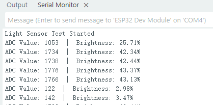
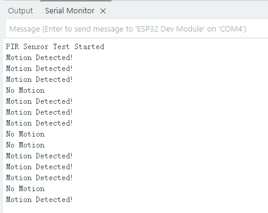
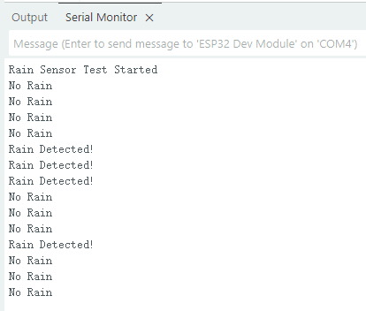
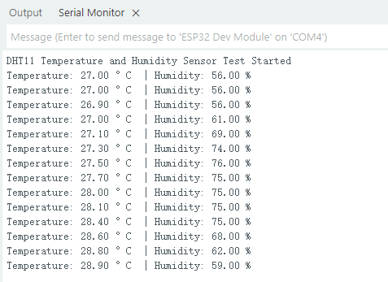

The  Kit Course Learning
========================

 - This kit not only provides you with a complete course curriculum but also guides you through a step-by-step in-depth study of the fundamentals and applications of the Internet of Things. 
 - In this section, we'll individually introduce each component and functional module included in the kit, from basic sensors and actuators to communication modules, to help you systematically understand their functions and usage. 
 - By studying the working principles of these components, you'll not only master how to connect and control modules in real-world projects, but also gain a deeper understanding of how IoT systems achieve environmental perception, intelligent linkage, and remote operation. 
 - This will lay a solid foundation for your subsequent experiments, course design, and IoT project development, allowing you to better grasp the core knowledge of smart hardware and the Internet of Things.
 - Click this link to download all the example code provided with this kit. `Download sample code <https://www.dropbox.com/scl/fi/j6oue7pij59qyy9cwqclh/CH34x_Install_Windows_v3_4.zip?rlkey=xttzwik1qp56naxw8v7ostmkq&e=1&st=kcy0xjl1&dl=0>`_  

----

Course 1：LED Module-Breathing Light
-----------------------------------

**Working principle:** 
LED (Light Emitting Diode) is a semiconductor device that can emit light. When a forward voltage is applied, the LED conducts in a single direction and emits light. By controlling the high and low levels of the circuit it is connected to, it can be turned on or off.

**wiring:** LED Module → ESP32 IO26

**Sample Code:**

.. code-block:: cpp

   #include <Arduino.h>
   const int ledPin = 26;   // LED PIN
   const uint32_t freq = 5000;
   const uint8_t resolution = 8;  // 0-255
   void setup() {
     Serial.begin(115200);
     Serial.println("breathing light");

     ledcAttach(ledPin, freq, resolution);
   }

   void loop() {
     // Bright
     for (int duty = 0; duty <= 255; duty++) {
       ledcWrite(ledPin, duty);
       delay(2);
     }

     // dark
     for (int duty = 255; duty >= 0; duty--) {
       ledcWrite(ledPin, duty);
       delay(2);
     }
   }

----
**Code burning options**

 - You can directly copy the code provided above into the Arduino IDE for burning.
 - Find the **1.BreathingLight.ino** file in the provided folder, download it, open it with the Arduino IDE, and burn the program to the ESP32 development board.
 - Alternatively, you can click this link to download the BIN firmware file we have prepared in advance and then burn the program into the ESP32 development board using Espressif's official burning tool. `1.BreathingLight <https://www.dropbox.com/scl/fi/j6oue7pij59qyy9cwqclh/CH34x_Install_Windows_v3_4.zip?rlkey=xttzwik1qp56naxw8v7ostmkq&e=1&st=kcy0xjl1&dl=0>`_  

**Code Explanation:**
*delay(10):* Wait 10ms each time the brightness is changed. You can change the breathing speed by changing the value.
 - Smaller value → faster breathing light
 - Larger value → slower breathing light

----

Course 2：Light Sensor-Brightness Detection
----------------------

**Working principle:** 
Light intensity affects the resistance or current of the sensor element. After internal voltage division, an analog voltage output is generated. The ESP32 reads the voltage value through the ADC and can calculate the current ambient brightness.

**wiring:** Light Sensor → ESP32 IO34

**Sample Code:**

.. code-block:: cpp

   #include <Arduino.h>

   // Define sensor pin
   const int lightSensorPin = 34;  // S pin connected to GPIO34 (ADC input)

   void setup() {
       Serial.begin(115200);
       delay(1000);
       Serial.println("Light Sensor Test Started");
   }

   void loop() {
       int sensorValue = analogRead(lightSensorPin);
       float brightnessPercent = sensorValue * 100.0 / 4095.0;
       Serial.print("ADC Value: ");
       Serial.print(sensorValue);
       Serial.print("  |  Brightness: ");
       Serial.print(brightnessPercent);
       Serial.println("%");
       delay(3000);
   }

----

**Code burning options**

 - You can directly copy the code provided above into the Arduino IDE for burning.
 - Find the **2.BrightnessDetection.ino** file in the provided folder, download it, open it with the Arduino IDE, and burn the program to the ESP32 development board.
 - Alternatively, you can click this link to download the BIN firmware file we have prepared in advance and then burn the program into the ESP32 development board using Espressif's official burning tool. `2.BrightnessDetection <https://www.dropbox.com/scl/fi/j6oue7pij59qyy9cwqclh/CH34x_Install_Windows_v3_4.zip?rlkey=xttzwik1qp56naxw8v7ostmkq&e=1&st=kcy0xjl1&dl=0>`_  

**Effect display:**
The surrounding brightness data will be output every 3 seconds on the **serial monito**

.. note::

   - If you see garbled or abnormal display in the **serial monitor**, please check and confirm that the baud rate is set to **115200 baud**. 
   - All sample codes provided by this kit use the baud rate of **115200 baud** by default.
   
   .. image:: _static/2/6.baud.png
      :width: 600
      :align: center

----

Course 3：PIR Sensor-Human Body Detection
----------------------------------------

**Working principle:** 
 - Pyroelectric chips sense infrared heat radiated by the human body. 
 - When a person moves into the sensing area, the temperature on both sides of the chip changes, generating a charge change that outputs a voltage signal. 
 - The sensor's internal circuitry amplifies the signal and reshapes it into digital high and low levels. 
 - High indicates a person is present. Low indicates no person is present.

**wiring:** PIR Sensor → ESP32 IO33

**Sample Code:**

.. code-block:: cpp

   #include <Arduino.h>

   // Define PIR sensor pin
   const int pirPin = 33;  // Signal pin connected to GPIO33

   void setup() {
       // Initialize serial communication at 115200 baud
       Serial.begin(115200);
       delay(1000); // Give time for Serial Monitor to start

       // Set PIR pin as input
       pinMode(pirPin, INPUT);

       Serial.println("PIR Sensor Test Started");
   }

   void loop() {
       // Read PIR sensor digital value
       int motionDetected = digitalRead(pirPin);

       if (motionDetected == HIGH) {
           // Motion detected
           Serial.println("Motion Detected!");
       } else {
           // No motion
           Serial.println("No Motion");
       }

       // Wait 3000 milliseconds before next reading
       delay(3000);
   }

----

**Code burning options**

 - You can directly copy the code provided above into the Arduino IDE for burning.
 - Find the **3.HumanBodyDetection.ino** file in the provided folder, download it, open it with the Arduino IDE, and burn the program to the ESP32 development board.
 - Alternatively, you can click this link to download the BIN firmware file we have prepared in advance and then burn the program into the ESP32 development board using Espressif's official burning tool. `3.HumanBodyDetection <https://www.dropbox.com/scl/fi/j6oue7pij59qyy9cwqclh/CH34x_Install_Windows_v3_4.zip?rlkey=xttzwik1qp56naxw8v7ostmkq&e=1&st=kcy0xjl1&dl=0>`_  

**Effect display:**
 - When the PIR sensor detects human movement, the blue indicator light will turn on.
 - The **serial monitor** will output whether a human body is detected.

----

Course 4：Raindrop Sensor-Raindrop Detection
--------------------------------------------

**Working principle:** 
 - When water droplets land on the electrode plates, they create conduction or change resistance. The sensor converts this change in conductance/resistance into a voltage signal. Outputs can be:
 - Digital signal: HIGH indicates a water droplet is detected, LOW indicates no water droplets.
 - Analog signal: The voltage value changes with the amount of water droplets.

**wiring:** Raindrop Sensor → ESP32 IO35

**Sample Code:**

.. code-block:: cpp

   #include <Arduino.h>

   // Define rain sensor pin
   const int rainSensorPin = 35;  // S pin connected to GPIO35

   void setup() {
       // Initialize serial communication at 115200 baud
       Serial.begin(115200);
       delay(1000);  // Give time for Serial Monitor to start

       // Set rain sensor pin as input
       pinMode(rainSensorPin, INPUT);

       Serial.println("Rain Sensor Test Started");
   }

   void loop() {
       // Read digital value from rain sensor
       int rainDetected = digitalRead(rainSensorPin);

       if (rainDetected == HIGH) {
           // Rain detected
           Serial.println("Rain Detected!");
       } else {
           // No rain
           Serial.println("No Rain");
       }

       // Delay 3000 milliseconds before next reading
       delay(3000);
   }

----

**Code burning options**

 - You can directly copy the code provided above into the Arduino IDE for burning.
 - Find the **4.RaindropDetection.ino** file in the provided folder, download it, open it with the Arduino IDE, and burn the program to the ESP32 development board.
 - Alternatively, you can click this link to download the BIN firmware file we have prepared in advance and then burn the program into the ESP32 development board using Espressif's official burning tool. `4.RaindropDetection <https://www.dropbox.com/scl/fi/j6oue7pij59qyy9cwqclh/CH34x_Install_Windows_v3_4.zip?rlkey=xttzwik1qp56naxw8v7ostmkq&e=1&st=kcy0xjl1&dl=0>`_  

**Effect display:**

 - When the electrodes of the raindrop sensor detect rain, the **serial monitor** will output "Rain Detected!"

----

Course 5：DHT11 Sensor-Temperature and humidity detection
------------------------------------------------------
**Working principle:** 
 - Temperature Sensing: An integrated NTC thermistor measures the ambient temperature by measuring the change in resistance with temperature.
 - Humidity Sensing: A capacitive humidity sensor is used. The dielectric constant of the capacitor changes with air humidity, thus providing relative humidity.
 - Signal Processing: An internal 8-bit microcontroller converts the analog temperature and humidity signals into digital signals, which are then transmitted to the main control unit via a single-wire bus protocol.

**wiring:** DHT11 Sensor → ESP32 IO15

**Sample Code:**

.. code-block:: cpp

   #include "DHT.h"

   // Define pin and sensor type
   #define DHTPIN 15         // DHT11 data pin connected to ESP32 GPIO15
   #define DHTTYPE DHT11     // Using DHT11 sensor

   DHT dht(DHTPIN, DHTTYPE); // Create DHT object

   void setup() {
       Serial.begin(115200);   // Initialize serial communication
       dht.begin();            // Initialize DHT11 sensor
       Serial.println("DHT11 Temperature and Humidity Sensor Test Started");
   }

   void loop() {
       delay(2000); // Read every 2 seconds

       float humidity = dht.readHumidity();       // Read humidity
       float temperature = dht.readTemperature(); // Read temperature (default Celsius)

       // Check if reading is successful
       if (isnan(humidity) || isnan(temperature)) {
           Serial.println("Failed to read from DHT11 sensor!");
           return;
       }

       // Output data to serial monitor
       Serial.print("Temperature: ");
       Serial.print(temperature);
       Serial.print(" °C  | Humidity: ");
       Serial.print(humidity);
       Serial.println(" %");
   }

----

**Code burning options**

 - You can directly copy the code provided above into the Arduino IDE for burning.
 - Find the **5.TEMHUM.ino** file in the provided folder, download it, open it with the Arduino IDE, and burn the program to the ESP32 development board.
 - Alternatively, you can click this link to download the BIN firmware file we have prepared in advance and then burn the program into the ESP32 development board using Espressif's official burning tool. `5.TEMHUM <https://www.dropbox.com/scl/fi/j6oue7pij59qyy9cwqclh/CH34x_Install_Windows_v3_4.zip?rlkey=xttzwik1qp56naxw8v7ostmkq&e=1&st=kcy0xjl1&dl=0>`_ 

**Effect display:**
 - The **serial monitor** will output the temperature and humidity of the surrounding environment.

----
